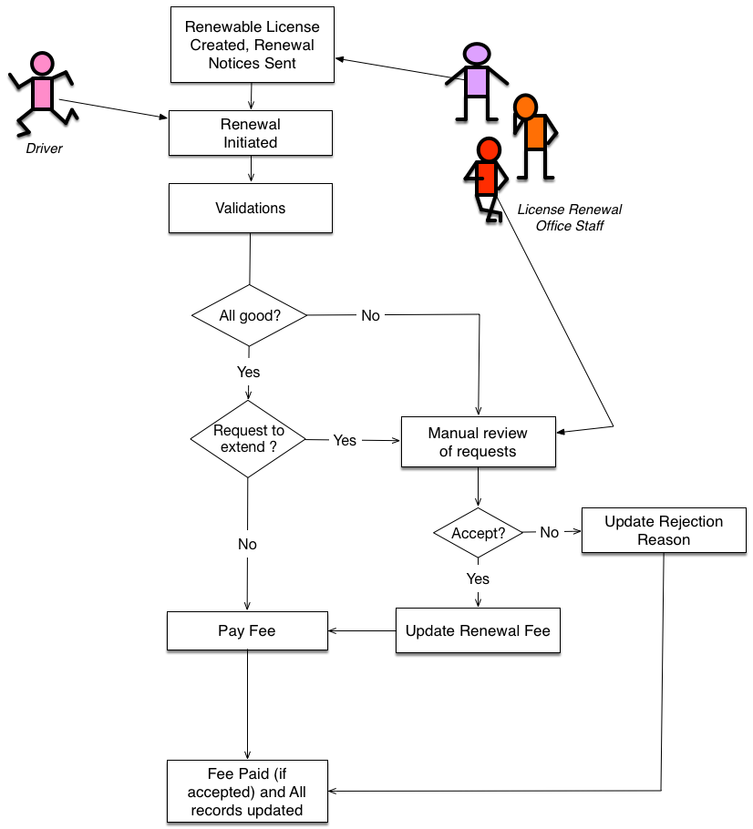

# Online License Renewal System

A system that implementing a workflow using RESTful and WS-* Services.

## Getting Started

### Prerequisites

System environment: JDK8+, Docker, MongoDB, MySQL

### Local Deployment && Run

#### REST Service deploy:
  * 1. check mongoDB version
    * `mongod -version`
    * make sure db version v3.4.9 or newer
  * 2. if all good, go to step 3, else install mongoDB
  * 3. you can install MongoDB Community Edition with Homebrew
    * 3.1 `brew update`
    * 3.2 `brew install mongoDB`
  * 4. unzip REST service
  * 5. run mongoDB server
    * 5.1. start mongoDB
      * `brew services start mongodb`
    * 5.2. create database: ORLS
      * 5.2.1. `mongo`
      * 5.2.2. `use ORLS`
      * 5.2.3. Exit mongoDB: `exit`
  * 6. run spring boot in eclipse
    * 6.1. import license-service into eclipse
    * 6.2. do maven update, this is important before first run
      * right click on project `license-service` - Maven - Update Project…
    * 6.3. put one email account for sending email form system. You can change at file: `au.edu.unsw.comp9322.REST.constant.Constant`
    * 6.4. The url for client is localhost:8080/client/... and the url for REST service is localhost:8090/api/... by default, you can also change the port for the service server in file above. However, if you leave it as it is, then you can ignore Client Deployment Plan 2.1    
    * 6.5. Change logger file path in `license-service/src/main/resources/application.properties`
    * 6.5. run application of license-service.java
  * 7. import MongoDB data
    * 7.1. import Service database
      `mongoimport --db ORLS --collection OLRS-license --drop --file OLRS-license`
      `mongoimport --db ORLS --collection OLRS-notice --drop --file OLRS-notice`
      `mongoimport --db ORLS --collection OLRS-payment --drop --file OLRS-payment`
      `mongoimport --db ORLS --collection OLRS-sequenceId --drop --file OLRS-sequenceId`

#### Client Side Deploy:
  * 1. Import Mysql database

    * 1.1. install MySQL
    * 1.2. import Client database
      `mysql -u {username} -p OLRS < client.sql`
  * 2. unzip ClientServer file and import it into Eclipse
  * 3. open java file: Constant.java in package:`au.edu.unsw.comp9322.CLIENT.constant`
    * 3.1. As mentioned above in Service Deployment Plan 6.4, for the variable “URL”, where it is now `8090` , change it to the port you prefer to setup the Service Server. It is prefered if you can leave it as it is, then you will not need to configure Service Deployment Plan 6.4.Vice Versa. (The Client Server is by default running on port `8080`)
    * 3.2. For the variable `SOAP_WSDL`: change it to your docker ip address. Detailed actions are in the comments above the variable.
    * 3.3. For the variable `MYSQL_PORT` :change it to your local Mysql port
    * 3.4. For the variable `MYSQL_DB_NAME` :only change it if you modified the name of the Mysql ORLS database
    * 3.5. For the variable `MYSQL_USERNAME` : change it to your username for login into the mysql db
    * 3.6. For the variable `MYSQL_PASSWORD` : change it to you password for login into the mysql db
  * Set variable for Logger
    * 4.1. Change file directory for the logger file: Open `src/main/webapp/WEB-INF/log4j.properties`
    * 4.2.. Change the forth line where it set value for `log4j.appender.ServerDailyRollingFile.File`, to the file directory you prefer to store the logger file for Client Side Request.
  * 5. Save the project, run as -> Run on Server
  * 6. Currently, the client database only has two login information. 
    * 6.1. As an officer, please login with username: `helen` and password:`123456`

### Data Service Deploy
  * import project into Eclipse and directly run it on apache server in eclipse
  * startup Server, run http://localhost:8080/license-dataservice/(API-URL) on Browser, (API-URL) refers to Design part in the project ‘doc’ folder

## Main Features

## Built With

* [SpringMVC](https://docs.spring.io/spring/docs/current/spring-framework-reference/web.html) - The web framework used
* [SpringBoot](https://spring.io/projects/spring-boot) - The web framework used
* [Maven](https://maven.apache.org/) - Dependency Management
* [FreeMarker](https://rometools.github.io/rome/) - Used to generate template
* [MyBatis](http://www.mybatis.org/mybatis-3/)

## Contributing

Please read [CONTRIBUTING.md](https://gist.github.com/PurpleBooth/b24679402957c63ec426) for details on our code of conduct, and the process for submitting pull requests to us. 

## Authors

* **Allen Li**
* **Charlie Zhao**

## License

This project is licensed under the MIT License - see the [LICENSE.md](LICENSE.md) file for details
